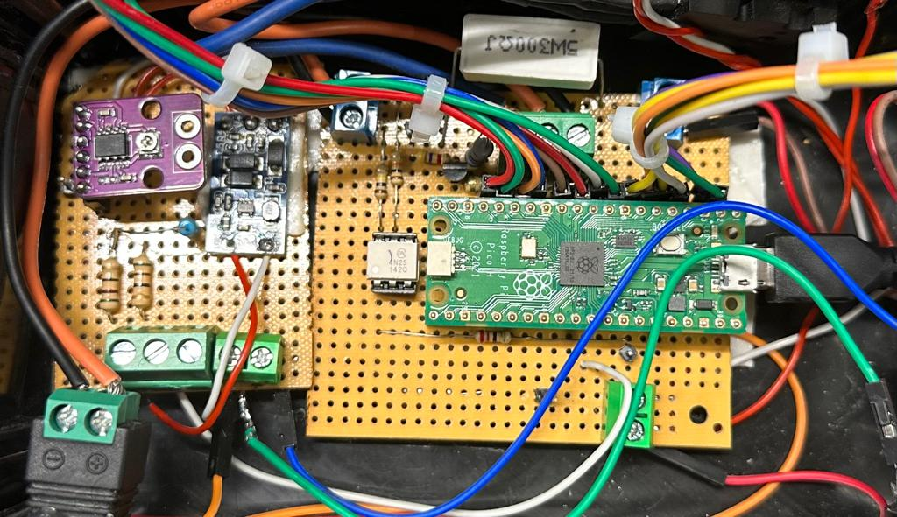

# EstacionSoldadura

ElecSolder

La idea del proyecto es desarrollar una estación de soldadura con control de temperatura digital. Esta estación permitirá a los usuarios seleccionar la temperatura deseada a través de un teclado matricial, la cual será ajustada utilizando un controlador PID. Además, mostrará la temperatura asignada por el usuario y la temperatura real de la estación de soldadura en un display LCD.

Requisitos Funcionales:

1. Ajuste de Temperatura: La estación permitirá a los usuarios configurar la temperatura de trabajo deseada mediante un teclado matricial.
2. Control PID: Utilizando un controlador PID, la estación alcanzará y mantendrá la temperatura asignada por el usuario en un rango estable.
3. Visualización de Temperatura: Se mostrará la temperatura asignada por el usuario y la temperatura en tiempo real de la estación de soldadura en un display LCD.

Requisitos No Funcionales:

1. Tamaño y Portabilidad: Puede requerir un diseño compacto y fácilmente transportable, dependiendo de su uso previsto.

